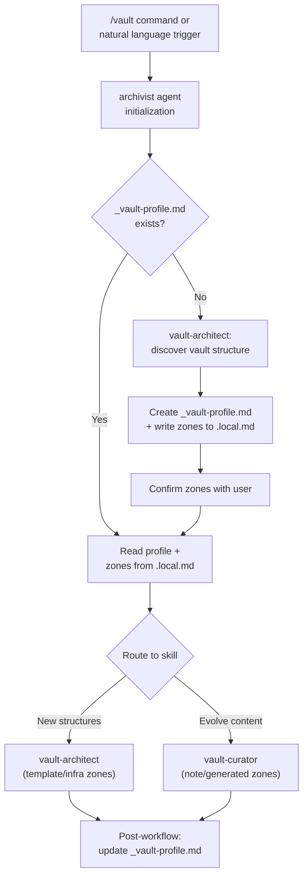

# feat: Add vault-aware permissions, automatic vault state, and workflow commands to archivist

## Overview

Three improvements to the archivist plugin: (1) vault-aware permission boundaries so each skill only writes to appropriate directories, (2) automatic vault state file creation on first run with ongoing maintenance, and (3) codified slash commands for common workflows.

## Problem Frame

The archivist plugin currently has a flat permission model — both vault-architect and vault-curator can write anywhere, with only a "Bounded Autonomy" section in the agent asking for user confirmation. This creates risk of the wrong skill writing to the wrong places. Additionally, each session starts cold — the archivist must rediscover vault structure every time because there's no guaranteed vault state file. Finally, common multi-step workflows (schema drift fix, collection setup, duplicate merge) require the user to know which workflow exists and how to describe it; there are no quick-trigger slash commands.

## Requirements Trace

- R1. Vault-aware permission boundaries: architect writes to templates/scripts/infrastructure, curator writes to notes/generated content, with vault-specific directories determined by architect's understanding of the vault
- R2. Automatic vault state file (`_vault-profile.md`) created on first archivist run, updated incrementally on subsequent runs, providing curator with immediate vault context
- R3. Slash commands for codified workflows that users can trigger directly without describing the workflow in natural language

## Scope Boundaries

- No changes to Python scripts — only skill/agent/command markdown files
- No new Python dependencies
- Permission model is advisory (enforced via skill instructions, not hard filesystem ACLs)
- Vault state file format remains markdown with YAML frontmatter (consistent with vault conventions)
- Commands are Claude Code slash commands (plugin `commands/` directory), not Obsidian URI handlers

## Context & Research

### Relevant Code and Patterns

- **Agent definition** (`agents/archivist.md`) — orchestrator that loads both skills, checks for `_vault-profile.md`, routes to architect vs curator
- **vault-architect SKILL.md** — creates templates, Bases files, schemas; writes to `900 📐Templates/` tree
- **vault-curator SKILL.md** — evolves existing content; writes to note directories, `800 Generated/` (canvas, discovery views)
- **`.local.md`** — stores `vault_path`, `daily_notes_path`, `templates_path`; logical place to also store permission zones
- **Existing safety** — "Bounded Autonomy" section in agent.md requires confirmation for writes, bulk changes, merges
- **Plugin command pattern** — `commands/vault.md` shows the existing command structure (frontmatter name/description + instruction body)

### Institutional Learnings

- The plugin already references `_vault-profile.md` in initialization and post-workflow sections, but creation is not enforced — it's an append-if-discovered pattern
- The `.local.md.example` only has 3 fields; extending it for permission zones is natural
- The brainstorm doc (`2026-02-10-pkm-plugin-enhancement-brainstorm.md`) anticipated slash commands but deferred them

## Key Technical Decisions

- **Permission zones in `.local.md` rather than hardcoded**: Each vault has a different folder structure. The architect should discover the vault's structure on first run and write permission zones to `.local.md`, which both skills read. This makes permissions vault-specific without requiring code changes per vault.

- **Vault state as `_vault-profile.md` in vault root**: This file lives in the vault (not the plugin) because it describes the vault, not the plugin. It's already referenced in the agent initialization. The change is making creation mandatory on first run rather than optional.

- **Permission enforcement via skill instructions, not hooks**: Hooks would add complexity and fragility. Instead, each skill's SKILL.md gets a "Write Boundaries" section that declares which directories it may write to, reads zones from `.local.md`, and self-enforces. The agent's Bounded Autonomy section becomes the backstop. The zone schema in `.local.md` should be designed to be hook-compatible (path-based matching) so a PreToolUse hook can be added later if soft enforcement proves insufficient.

- **Zones are write-only restrictions**: Both skills can read any file in the vault — zones only restrict writes. This ensures curator can build a full vault picture (reading templates, scanning all folders) while being prevented from modifying architect-owned files. Read access is unrestricted by design.

- **Zone precedence — most-specific path wins**: When zones overlap (e.g., `900 📐Templates/` is architect, but `900 📐Templates/970 Bases/` could be shared), the most-specific matching path wins. Zones are matched by path prefix, longest match first. This avoids the need for complex nesting rules.

- **Agents Rule of Two governs all writes (confirmation-free zones deferred)**: The archivist satisfies all three properties — [A] processes untrustworthy inputs (web-imported notes from Omnivore/Readwise), [B] accesses sensitive data (private vault), [C] changes state (writes files). Per the Rule of Two, this requires human-in-the-loop supervision. The existing Bounded Autonomy provides this via user confirmation. **All writes require confirmation in this version** — confirmation-free zones are deferred until hook-based enforcement can track whether untrusted content was read in the session. The `.local.md` schema includes a `designated_output_zones` field for forward compatibility, but skills ignore it and always confirm writes.

- **Vault directory trust levels (future enforcement foundation)**: Different vault areas have different sensitivity and autonomy profiles. The vault profiling workflow should discover and record these trust levels in `_vault-profile.md` so future hook-based enforcement can use them:
  - **Automated/generated** (e.g., `800 Generated/`): intended for LLM output, low sensitivity, future candidate for reduced confirmation
  - **Project-scoped** (e.g., `600 Projects/` subdirectories): sensitivity varies per project, guidelines may differ by subdirectory
  - **Personal/guarded** (e.g., `700 Notes/`): personal content, higher sensitivity, should be guarded against exfiltration
  - **Infrastructure** (e.g., `900 📐Templates/`): structural files, architect-owned
  These categorizations should eventually be embedded in vault structure (e.g., folder notes, frontmatter conventions) so the archivist can discover them automatically rather than relying on hardcoded heuristics.

- **Commands as thin wrappers with auto-setup**: Each new command is a markdown file in `commands/` that delegates to the archivist agent with a specific workflow directive. Commands don't contain workflow logic — they trigger the agent with intent. If prerequisites are missing (no `.local.md`, no `_vault-profile.md`), commands auto-trigger first-run setup rather than failing — the user should never see "run /setup first."

## Open Questions

### Resolved During Planning

- **Where do permission zones live?** → `.local.md` — it's already per-vault config, and extending it is natural.
- **Should permissions be hard-enforced (hooks) or soft-enforced (instructions)?** → Soft enforcement via skill instructions. Hard enforcement would require a PreToolUse hook that parses file paths against zones, adding significant complexity for marginal benefit when the skills already ask for confirmation.
- **How does the architect determine zones on first run?** → It reads vault folder structure, identifies template directories (matching `Template` or `📐`), generated output directories (matching `Generated`), and note content directories (everything else). It writes these to `.local.md` and presents them to the user for confirmation.

### Deferred to Implementation

- Exact YAML structure for permission zones in `.local.md` — will be determined when implementing Unit 2, but must use path-based matching (hook-compatible)
- Which additional commands beyond the initial set have enough value — add incrementally based on usage
- Whether a `/zones` command for editing zones is needed — start with manual `.local.md` editing, add command if users struggle

## High-Level Technical Design

> *This illustrates the intended approach and is directional guidance for review, not implementation specification. The implementing agent should treat it as context, not code to reproduce.*

**Permission zone model:**
- **Architect zones** (write-allowed): template directories, Bases directory, script directories, vault infrastructure files (`_vault-profile.md`, system guides)
- **Curator zones** (write-allowed): note content directories, generated output directory (canvas, discovery views), existing note files for property updates
- **Shared read**: both skills can read anything
- **Designated output zones** (forward compatibility): field exists in `.local.md` but is not acted on — all writes require confirmation until hook-based enforcement is available
- **Confirmation-required**: all writes require user approval (existing Bounded Autonomy behavior, reinforced by Agents Rule of Two)
- **Trust levels** (recorded in vault profile for future use): automated/generated, project-scoped (per-project), personal/guarded, infrastructure

## Implementation Units

- [ ] **Unit 1: Vault state file creation on first run**

  **Goal:** Make `_vault-profile.md` creation mandatory on first archivist session, with incremental updates on subsequent sessions.

  **Requirements:** R2

  **Dependencies:** None

  **Files:**
  - Modify: `agents/archivist.md` (initialization section)
  - Modify: `skills/vault-architect/SKILL.md` (add vault profiling workflow)

  **Approach:**
  - Extend the agent's initialization step 2: if `_vault-profile.md` doesn't exist, invoke vault-architect's new "Vault Profiling" workflow before proceeding
  - Add a "Vault Profiling" section to vault-architect SKILL.md that: runs `analyze_vault.py`, reads plugin directory for installed plugins, samples fileClass distribution, reads linter config, discovers folder philosophy from top-level names, proposes permission zones based on folder analysis (see Unit 2 for zone storage/enforcement), and writes `_vault-profile.md`
  - The profile should capture: `last_updated` timestamp (display-only for user awareness), installed plugins, active fileClasses with counts, folder philosophy (numbered prefix convention, emoji meanings), template inventory summary, known schema conventions, Linter rules summary, and **directory trust levels** (automated/generated, project-scoped, personal/guarded, infrastructure) — discovered from folder names and confirmed with user
  - On subsequent runs, the agent's Session Learning section already handles updates — strengthen it to use section-based replacement (update specific sections by heading, preserving any user-added sections the agent doesn't manage)
  - If `_vault-profile.md` exists but is corrupted or unparseable, regenerate from scratch rather than failing — the vault itself is the source of truth, the profile is a cache

  **Patterns to follow:**
  - Existing `agents/archivist.md` Post-Workflow > Session Learning section
  - Existing vault-architect SKILL.md > Vault Discovery section

  **Test scenarios:**
  - Happy path: First run with no `_vault-profile.md` → agent creates profile with correct sections, presents to user, saves to vault root
  - Happy path: Subsequent run with existing `_vault-profile.md` → agent reads it, discovers a new plugin was installed, updates the plugins section without overwriting other sections
  - Edge case: `obsidian vault` command fails (app not running) → falls back to file tools for discovery, still creates profile
  - Edge case: Vault with minimal structure (few folders, no templates) → profile is created with minimal content, not padded with empty sections
  - Edge case: Existing `_vault-profile.md` is corrupted (malformed YAML) → agent regenerates from scratch, warns user that old profile was replaced
  - Edge case: User manually added custom sections to profile (e.g., "## My Conventions") → section-based update preserves user sections, only updates agent-managed sections

  **Verification:**
  - After first run, `_vault-profile.md` exists in vault root with frontmatter and at least: plugins, fileClasses, folder structure sections
  - After second run with vault changes, profile reflects the changes without losing existing content

- [ ] **Unit 2: Permission zones in `.local.md`**

  **Goal:** Define vault-specific write boundaries for each skill, stored in `.local.md` and enforced via skill instructions.

  **Requirements:** R1

  **Dependencies:** Unit 1 (vault profiling discovers folder structure and proposes zones; this unit defines how zones are stored in `.local.md` and enforced in skill instructions)

  **Files:**
  - Modify: `.local.md.example` (add zone fields as documentation template — users copy this to `.local.md`)
  - Modify: `skills/vault-architect/SKILL.md` (add Write Boundaries section + zone discovery logic)
  - Modify: `skills/vault-curator/SKILL.md` (add Write Boundaries section)
  - Modify: `agents/archivist.md` (add zone loading to initialization, update Bounded Autonomy)

  **Approach:**
  - Extend `.local.md.example` with zone configuration fields: `architect_write_zones`, `curator_write_zones`, `designated_output_zones` (forward compatibility — not enforced until hooks exist)
  - During vault profiling (Unit 1), architect analyzes folder names to propose zones:
    - Template-like folders → architect zone
    - Generated/output folders → confirmation-free zone
    - Everything else → curator zone (with confirmation)
  - Present proposed zones to user for confirmation before writing to `.local.md`
  - Add "Write Boundaries" section to each SKILL.md that reads zones from `.local.md` and states the rule: "Before writing to any path, check if it falls within your allowed zones. If not, refuse and suggest the correct skill."
  - Agent's Bounded Autonomy section references zones and adds: all writes require confirmation (Rule of Two); writes outside any skill's zones are refused and suggest the correct skill

  **Patterns to follow:**
  - Existing `.local.md.example` format (simple `key: value` lines)
  - Existing Bounded Autonomy section in `agents/archivist.md`
  - vault-architect's Vault Discovery section for folder analysis patterns

  **Test scenarios:**
  - Happy path: First run discovers `900 📐Templates/` as architect zone, `800 Generated/` as confirmation-free, `700 Notes/` as curator zone → zones written to `.local.md`, both skills respect them
  - Happy path: Curator attempts to write a template file → skill self-refuses, suggests using architect instead
  - Happy path: Write to `800 Generated/` directory → still requires confirmation (confirmation-free deferred), but agent notes this is a designated output zone
  - Edge case: Vault with non-standard folder names (no emoji prefixes, no numbered folders) → architect asks user to designate zones manually
  - Edge case: `.local.md` exists but has no zones → architect offers to add zones based on current vault structure
  - Edge case: Zone precedence — curator writes to `900 📐Templates/970 Bases/` which is shared, while `900 📐Templates/` is architect-only → most-specific match allows curator write
  - Edge case: User cancels zone confirmation → session proceeds without zones (all writes require confirmation, degraded but functional)
  - Edge case: Rule of Two — all writes require confirmation regardless of zone (confirmation-free deferred until hook enforcement); designated_output_zones field exists in `.local.md` but is informational only

  **Verification:**
  - `.local.md` contains zone definitions after first run
  - Each skill's SKILL.md has a Write Boundaries section that references `.local.md` zones
  - Agent initialization loads zones and makes them available to skill routing

- [ ] **Unit 3: Slash commands for common workflows**

  **Goal:** Add user-invokable slash commands for the most common archivist workflows.

  **Requirements:** R3

  **Dependencies:** None (can be implemented in parallel with Units 1-2)

  **Files:**
  - Create: `commands/health.md` (vault health check)
  - Create: `commands/drift.md` (schema drift detection)
  - Create: `commands/duplicates.md` (find similar notes)
  - Create: `commands/canvas.md` (generate knowledge map)
  - Create: `commands/collection.md` (collection setup or health check)
  - Modify: `.claude-plugin/plugin.json` (no change needed — commands auto-discovered from `commands/` directory)

  **Approach:**
  - Each command is a thin markdown file with frontmatter (name, description) and a body that directs the archivist agent to run a specific workflow
  - Commands should include the minimum context needed: which workflow to run, whether to start with scope selection, and any default parameters
  - The existing `vault.md` command is the pattern — it invokes the archivist agent with specific instructions
  - Initial command set based on the workflows most frequently triggered in natural language:
    - `/health` — run vault health snapshot (orphans, inbox, drift signals)
    - `/drift` — schema drift detection for a fileClass
    - `/duplicates` — find similar notes in a scope
    - `/canvas` — generate knowledge map canvas
    - `/collection` — scaffold new collection or audit existing one

  **Patterns to follow:**
  - `commands/vault.md` structure (frontmatter + agent invocation instructions)

  **Test scenarios:**
  - Happy path: User runs `/health` → archivist agent launches, runs health snapshot, reports results without requiring additional prompts
  - Happy path: User runs `/drift` → agent asks for fileClass and scope, then runs detection
  - Happy path: User runs `/canvas` with scope argument → agent skips scope selection, generates canvas directly
  - Edge case: Command run when vault connection fails → falls back to file tools gracefully
  - Edge case: Command run with no `.local.md` or `_vault-profile.md` → auto-triggers first-run setup, then proceeds to the requested workflow
  - Edge case: User runs `/health` immediately after vault installation (near-empty vault) → health check completes with minimal results, doesn't error on missing structures

  **Verification:**
  - Each command file exists in `commands/` with correct frontmatter
  - Running each command triggers the archivist agent with the correct workflow
  - Commands appear in Claude Code's slash command listing

- [ ] **Unit 4: Update agent orchestration for zones and state**

  **Goal:** Wire Units 1-3 together in the agent definition — initialization reads zones, enforces state file creation, and commands route correctly.

  **Requirements:** R1, R2, R3

  **Dependencies:** Units 1, 2, 3

  **Files:**
  - Modify: `agents/archivist.md` (update initialization flow, add zone-aware routing, strengthen session learning)

  **Approach:**
  - Consolidate initialization modifications from Units 1-2 into coherent flow:
    1. Load domain knowledge (unchanged)
    2. Read `.local.md` for vault path AND zones
    3. Check for `_vault-profile.md` — if absent, run vault profiling workflow (Unit 1)
    4. Read vault profile for session context
    5. Verify vault connection
  - Add zone-aware routing: when delegating to a skill, pass the relevant zones as context
  - Strengthen Session Learning to diff vault state and update profile incrementally
  - Ensure new commands are documented in the orchestration section

  **Patterns to follow:**
  - Existing Initialization section in `agents/archivist.md`
  - Existing Post-Workflow section in `agents/archivist.md`

  **Test scenarios:**
  - Happy path: Complete first-run flow — agent creates profile, discovers zones, writes `.local.md`, then proceeds to user's request
  - Happy path: Subsequent run — agent reads existing profile and zones, skips creation, proceeds directly
  - Integration: User runs `/drift` → agent initializes with zones → routes to curator with curator zones loaded → curator self-enforces write boundaries during fixes

  **Verification:**
  - Agent initialization completes with zones loaded and profile available
  - Zone information is accessible to whichever skill is invoked
  - Session learning updates profile without data loss

## System-Wide Impact

- **Interaction graph:** The agent is the entry point for all commands and natural language triggers. It delegates to vault-architect or vault-curator. The new permission zones flow: `.local.md` → agent initialization → skill context. The vault state flows: vault analysis → `_vault-profile.md` → agent reads at startup → passes to skills.
- **Error propagation:** If `.local.md` is missing or malformed, the agent should fall back to asking the user for vault path (existing behavior) and offering to create zones. If `_vault-profile.md` creation fails, the session should proceed without it (degraded but functional).
- **State lifecycle risks:** `_vault-profile.md` could drift from actual vault state if the user makes changes outside archivist sessions. The incremental update in Session Learning mitigates this by re-checking on each session.
- **API surface parity:** New commands should be listed in the plugin README for discoverability. No external API changes.
- **Unchanged invariants:** All existing Python scripts remain unchanged. Existing vault-architect and vault-curator workflows remain the same — they gain write boundary awareness but no workflow logic changes. The `obsidian-cli` integration is unaffected.

## Risks & Dependencies

| Risk | Mitigation |
|------|------------|
| Permission zones too restrictive — blocks legitimate cross-skill writes | Zones are advisory with user override. Skills suggest the correct skill rather than hard-blocking. |
| Vault profile becomes stale between sessions | Session Learning diffs against current state. Profile includes `last_updated` timestamp so staleness is visible. |
| Too many slash commands dilute discoverability | Start with 5 high-value commands. Add more only when usage patterns emerge. |
| Zone discovery misclassifies folders in non-standard vaults | Architect presents proposed zones for user confirmation rather than auto-applying. |
| Vault drastically reorganized between sessions (50%+ folders changed) | Session Learning diffs against current state; large diffs (affecting 50%+ of profiled sections) presented to user with option to regenerate or accept incremental update. |
| User needs to reassign zones after initial setup | Zones live in `.local.md` which is user-editable. Future `/zones` command can be added if manual editing proves error-prone. |
| Prompt injection via web-imported vault content could influence agent writes | Agents Rule of Two: all writes require confirmation (confirmation-free deferred until hook enforcement). Vault directory trust levels recorded in profile for future graduated enforcement. |

## Future Architecture: Subagent Separation (v2)

**Status:** Deferred — implement after v1 is stable and trust level taxonomy is validated in practice.

**Problem:** In v1, the archivist agent loads both skills into a single context window with all tools. This means a single agent has [A] untrusted input + [B] sensitive data + [C] state changes simultaneously, requiring human-in-the-loop for every write (Rule of Two). This is safe but creates confirmation fatigue for low-risk operations.

**Target architecture:** Split the archivist into an orchestrator + two worker subagents with different trust profiles:

| Worker | Tools | Reads untrusted [A] | Sensitive data [B] | State changes [C] | Rule of Two |
|--------|-------|:---:|:---:|:---:|-------------|
| **architect-worker** | Read, Bash, Grep, Glob, Write | No — folder structure, configs, templates only | Yes | Yes — creates new files | [B]+[C] = compliant, reduced confirmation |
| **curator-worker** | Read, Bash, Grep, Glob, Edit, AskUserQuestion | Yes — note content incl. web imports | Yes | Yes — modifies existing notes, always confirms | [A]+[B]+[C] with HITL = compliant |
| **archivist (orchestrator)** | Read, Grep, Glob, Agent | No — reads profile + zones only | Minimal — routing context | No — delegates all writes | [B] only = compliant |

**How trust levels feed into this:** The directory trust levels discovered in v1 (`_vault-profile.md`) determine which worker handles each operation:
- Writes to **automated/generated** directories → architect-worker (no untrusted content processed, reduced confirmation possible)
- Writes to **personal/guarded** directories → curator-worker (always requires confirmation)
- Writes to **project-scoped** directories → curator-worker with per-project guidelines from folder notes
- Writes to **infrastructure** directories → architect-worker

**Confirmation-free zones become safe:** Because the architect-worker never reads untrusted note content [A], it satisfies the Rule of Two with only [B]+[C]. This means writes to designated output zones can skip confirmation when routed through the architect-worker — the architectural isolation provides the enforcement that LLM instructions cannot.

**Why this must wait for v2:**
1. Trust level taxonomy needs validation in real usage before encoding enforcement rules
2. Subagent spawning adds latency — need to verify the UX tradeoff
3. v1's all-writes-require-confirmation is the safe baseline to build confidence on

### v1 Architectural Seams for v2

To prevent v2 from being lost, v1 implementation must include these structural hooks that make v2 a natural extension:

1. **Agent routing as explicit decision point:** Unit 4's initialization should route through a clear `determine_worker()` decision — "which skill handles this request?" In v1 this selects a skill inline; in v2 it spawns a subagent. The decision point is the same; only the dispatch mechanism changes.

2. **Trust levels in vault profile:** Unit 1's vault profiling must record directory trust levels in `_vault-profile.md`, even though v1 doesn't enforce them. This ensures the data exists when v2 needs it.

3. **Zone schema supports worker assignment:** The `.local.md` zone fields should be structured so a future `worker:` attribute can be added per zone without breaking the existing schema.

4. **Write Boundaries reference future worker model:** Each skill's Write Boundaries section should include a comment: "In future versions, this skill may run as an isolated subagent with restricted tools. Write boundaries documented here will become the subagent's tool restrictions."

These seams ensure that v2 is implemented by evolving v1's routing and adding agent definitions — not by rewriting the permission model.

## Sources & References

- Plugin source: `/Users/gregwilliams/Documents/Projects/claude-mp/plugins/archivist/`
- Prior brainstorm: `docs/brainstorms/2026-02-10-pkm-plugin-enhancement-brainstorm.md`
- Claude Code plugin development: `plugin-dev:plugin-structure` skill
- Claude Code command development: `plugin-dev:command-development` skill
