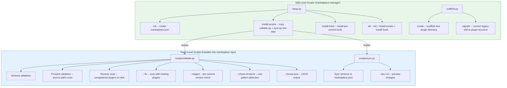
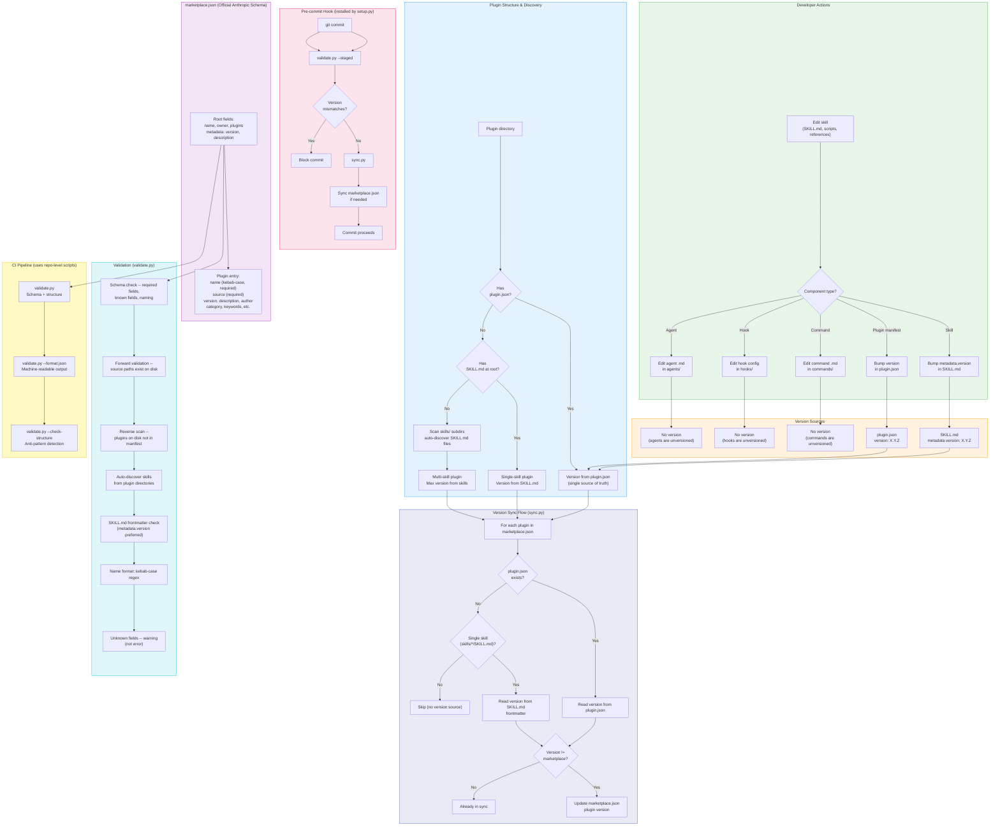

# marketplace-manager

Plugin marketplace operations: version syncing, skill publishing, and marketplace.json maintenance.

## Components

### Skill: marketplace-manager
Self-sufficient marketplace repo model with two-tier script architecture:
- Repo-level scripts (validate.py, sync.py) installed into marketplace repos for standalone operation
- Skill-level scripts (setup.py, scaffold.py) for repo initialization and plugin scaffolding
- Official Anthropic schema validation with reverse scan and auto-fix
- Pre-commit hook using repo-local scripts

### Commands (5)

| Command | Purpose |
|---------|---------|
| `/mp-sync` | Sync plugin versions to marketplace.json |
| `/mp-validate` | Validate marketplace.json against official schema |
| `/mp-add` | Scaffold a new plugin or migrate a legacy skill |
| `/mp-list` | List all marketplace plugins |
| `/mp-status` | Show version mismatches and validation summary |

### Scripts

| Script | Tier | Purpose |
|--------|------|---------|
| `scripts/setup.py` | Skill | Initialize marketplace repo, copy scripts, install hook |
| `scripts/scaffold.py` | Skill | Scaffold new plugin or migrate legacy skill |
| `scripts/repo/validate.py` | Repo | Schema validation, forward/reverse scan, auto-fix, CI output |
| `scripts/repo/sync.py` | Repo | Sync versions from plugin.json/SKILL.md to marketplace.json |

### References

| Reference | Content |
|-----------|---------|
| `references/official_docs_index.md` | Official Anthropic documentation links |
| `references/plugin_marketplace_guide.md` | Plugin structure and marketplace schema |
| `references/marketplace_distribution_guide.md` | Distribution workflow and best practices |
| `references/troubleshooting.md` | Common issues and solutions |
| `references/ci-example-github-actions.yml` | GitHub Actions CI example |
| `references/ci-example-gitlab-ci.yml` | GitLab CI example |

### Key Concepts

- **Two-tier model**: After `setup.py all`, repos own their own validation and sync with no runtime dependency on marketplace-manager
- **Version source priority**: plugin.json > SKILL.md metadata.version > SKILL.md root version (non-standard)
- **Pre-commit hook**: runs `validate.py --staged` then `sync.py` -- blocks on version issues, auto-syncs otherwise
- **Repo-level scripts are stdlib-only** -- no external dependencies, vendorable into any repo
- **Workflow**: `plugin-dev` (build) > `skillsmith` (improve) > `marketplace-manager` (publish)

## Two-Tier Architecture

## Component Lifecycle Flow

## Changelog

| Version | Changes |
|---------|---------|
| 4.0.0 | Official Anthropic schema alignment, self-sufficient repo model, 12 scripts replaced by 4, reverse scan + auto-fix |
| 2.9.0 | Multi-plugin structure detection (`--check-structure`), CI mode (`--ci`), advisory hook warning, docs |
| 2.8.0 | Undeclared skill detection in validate; uv guard; license frontmatter fix |
| 2.7.0 | Add trigger phrases to description |
| 2.5.0 | plugin-dev docs, two-pass find_repo_root(), plugin.json schema validation, pre-commit hook v5.0.0 |
| 2.0.0 | Migrated to plugin structure |

## Skill: marketplace-manager

### Current Metrics

**Score: 100/100** (Excellent) — 2026-03-26

| Concs | Complx | Spec | Progr | Descr |
|-------|--------|------|-------|-------|
| 100 | 100 | 100 | 100 | 100 |

### Version History

| Version | Date | Issue | Summary | Concs | Complx | Spec | Progr | Descr | Score |
|---------|------|-------|---------|-------|--------|------|-------|-------|-------|
| 4.0.0 | 2026-03-26 | [#145](https://github.com/totallyGreg/claude-mp/issues/145) | Official schema alignment, self-sufficient repo model, 12 scripts replaced by 4, reverse scan + auto-fix | 100 | 100 | 100 | 100 | 100 | 100 |
| 3.1.0 | 2026-03-25 | - | Fix validator schema guidance: remove metadata from known fields, correct version/description migration advice, merge SKILL.md sections (10→4 H2s), add negative trigger clause | 100 | 100 | 100 | 100 | 100 | 100 |
| 2.9.0 | 2026-03-23 | [#139](https://github.com/totallyGreg/claude-mp/issues/139) | Multi-plugin structure detection (`--check-structure`), CI mode (`--ci`), advisory hook warning, docs | 100 | 87 | 100 | 100 | 100 | 97 |
| 2.8.0 | 2026-03-21 | - | Undeclared skill detection in validate; uv guard on add_to_marketplace.py; license field fix | 100 | 90 | 100 | 100 | 100 | 98 |
| 2.5.1 | 2026-03-03 | - | Add trigger phrases to description | 100 | 83 | 90 | 100 | - | 93 |
| 2.5.0 | 2026-03-03 | [#25](https://github.com/totallyGreg/claude-mp/issues/25), [#30](https://github.com/totallyGreg/claude-mp/issues/30), [#75](https://github.com/totallyGreg/claude-mp/issues/75), [#78](https://github.com/totallyGreg/claude-mp/issues/78) | plugin-dev docs, two-pass find_repo_root(), plugin.json schema validation, pre-commit hook v5.0.0 with drift/mismatch separation | 100 | 83 | 90 | 100 | - | 89 |
| 2.4.0 | 2026-03-03 | [#78](https://github.com/totallyGreg/claude-mp/issues/78) | Detect skill version drift from plugin.json in multi-skill plugins | - | - | - | - | - | - |
| 2.3.0 | 2026-02-16 | - | Plugin versioning strategy: plugin.json as version source, detect refactor, hook stages README.md | 100 | 83 | 90 | 100 | - | 89 |
| 2.0.0 | 2026-02-03 | - | Standalone plugin migration: Moved to plugins/, added commands, improved SKILL.md conciseness | - | - | - | - | - | - |
| 1.5.0 | 2026-01-23 | - | Deprecate skill-planner skill: Removed from marketplace, updated workflow documentation | - | - | - | - | - | - |
| 1.4.0 | 2026-01-22 | [#4](https://github.com/totallyGreg/claude-mp/issues/4), [#5](https://github.com/totallyGreg/claude-mp/issues/5) | Core marketplace operations automation: source path fixes, deprecation, bundling, templates | - | - | - | - | - | 75 |
| 1.3.0 | 2026-01-07 | - | Critical bug fixes: utils.py dependency, schema compliance, metadata.version parsing | - | - | - | - | - | - |
| 1.1.0 | 2025-12-22 | - | Added plugin versioning strategies, validation command, pre-commit hook | - | - | - | - | - | - |
| 1.0.0 | 2025-12-21 | - | Initial release | - | - | - | - | - | - |

**Metric Legend:** Concs=Conciseness, Complx=Complexity, Spec=Spec Compliance, Progr=Progressive Disclosure, Descr=Description Quality (0-100 scale)

