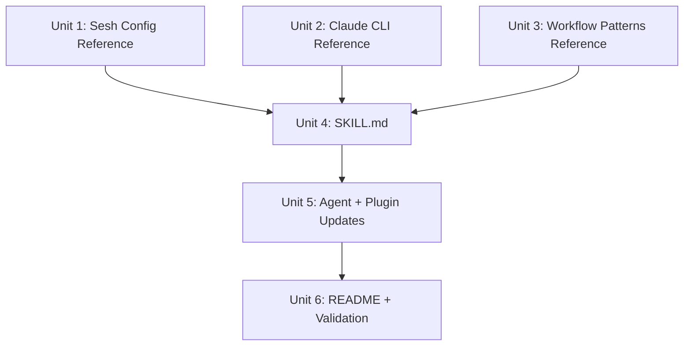

# feat: Add environment-composition skill to terminal-guru

## Overview

Add a fourth skill to the terminal-guru plugin that teaches users how to compose development environments from sesh (tmux session manager), claude CLI, direnv, and git worktrees. The skill uses the Lens concept (Selection, Arrangement, Purpose, Activation) as an internal organizing framework, with sesh's config system (`sesh.toml`) as both the foundation layer and the natural local state. The agent suggests tool compositions as sesh.toml config snippets; users iterate on their sesh.toml; proven patterns graduate to skill references.

## Problem Frame

Development environments are manually assembled from independent tools with no unified guidance. Setup is ad-hoc, teardown loses context, and environments decay over time. Sesh already implements much of the composition pattern natively through its config system — the skill's job is to teach users to extend sesh with claude CLI, direnv, and worktrees. (see origin: plugins/terminal-guru/docs/brainstorms/2026-04-01-environment-composition-skill-requirements.md)

## Requirements Trace

- R1. Claude CLI reference scoped to composition-relevant features
- R2. Comprehensive sesh v2.24+ reference covering full config system
- R3. direnv integration patterns for sesh + claude CLI
- R4. Combined setup patterns (sesh + claude --resume)
- R5. Worktree composition patterns (worktree per tmux session)
- R6. Teardown patterns (preserve state, clean up)
- R7. Environment decay detection patterns
- R8. Agent suggests compositions using Lens layers as checklist, outputting sesh.toml config snippets
- R9. ~~Local state file~~ Superseded: sesh.toml serves as local state for environment composition
- R10. ~~Agent reads local state~~ Superseded: agent suggests sesh.toml patterns; user iterates in sesh.toml directly
- R11. New skill directory with SKILL.md and references
- R12. Skill trigger phrases
- R13. Cross-reference terminal-emulation, don't duplicate
- R14. Update agent routing table
- R15. Update plugin.json

## Scope Boundaries

- Documents patterns and commands, not automation scripts
- Claude CLI scoped to composition features, not a full manual
- Sesh gets comprehensive coverage as the foundation tool
- Cross-references terminal-emulation for general tmux and chronicle for worktree lifecycle
- Does not modify the Obsidian Lensing note

## Context & Research

### Relevant Code and Patterns

- `plugins/terminal-guru/skills/zsh-dev/SKILL.md` — exemplar skill (score 98/100): frontmatter with name/description/metadata.version, progressive disclosure, negative triggers, under 150 lines
- `plugins/terminal-guru/agents/terminal-guru.md` — agent with symptom-to-domain routing table, currently "Your Three Skills"
- `plugins/terminal-guru/.claude-plugin/plugin.json` — manifest at v4.0.0, describes "three focused skills"
- `plugins/terminal-guru/skills/terminal-emulation/references/tmux_session_management.md` — existing sesh/direnv/tmux reference to cross-reference
- `plugins/chronicle/skills/chronicle/references/worktrees-experiments.md` — worktree lifecycle patterns to cross-reference
- Reference naming convention: snake_case with `_guide` or `_patterns` suffix

### Institutional Learnings

- **Conciseness is critical**: terminal-guru historically scored 36/100 on conciseness with 588-line SKILL.md. After splitting into focused skills, zsh-dev hit 98/100. Keep SKILL.md under 150 lines, push details to references. (docs/lessons/skills-evaluation-summary.md)
- **Cross-reference, don't duplicate**: Orphaned and duplicated references are the most common quality issue across the repo. (docs/lessons/skills-evaluation-summary.md)
- **sesh.toml as local state**: sesh's config file (`~/.config/sesh/sesh.toml`) naturally serves as the local state for environment composition — `[[session]]`, `[[wildcard]]`, and `[[window]]` entries define the user's environment patterns. No separate `.local.md` needed.
- **Negative triggers prevent routing overlap**: zsh-dev's SKILL.md includes "Do NOT use for terminal display issues" — environment-composition needs the same pattern to disambiguate from terminal-emulation. (docs/lessons/plugin-integration-and-architecture.md)
- **Reference file paths in SKILL.md examples**: Prefer short names over full paths to avoid skillsmith false positives. (docs/lessons/evaluate-skill-false-positives.md)
- **Version management**: New skill starts at v1.0.0; adding a skill is a major structural change, so plugin bumps to 5.0.0 (precedent: signals-monitoring addition bumped 3.0.0 to 4.0.0). (docs/solutions/logic-errors/multi-skill-plugin-version-sync.md)

### Claude CLI Session Features (Resolved During Planning)

| Flag | Composition Role |
|------|-----------------|
| `--continue` | Resume most recent conversation in current directory — pairs with sesh directory-based sessions |
| `--resume [term]` | Resume by session ID or open interactive picker with optional search — session discovery |
| `--name <name>` | Label sessions for human readability — pairs with sesh session naming |
| `--session-id <uuid>` | Target specific session — programmatic resume |
| `--worktree [name]` | Create git worktree for session — native isolation |
| `--tmux` | Create tmux session for worktree (requires `--worktree`) — native sesh integration |
| `--fork-session` | Branch from existing session — exploratory work |
| `--from-pr [value]` | Resume session linked to PR — code review context |

No `claude sessions` subcommand exists. `--continue` is directory-scoped, making it the natural pairing with sesh's directory-based session creation.

## Key Technical Decisions

- **SKILL.md under 150 lines, 3 reference files**: Follows the zsh-dev exemplar. SKILL.md provides overview, triggers, capability summaries, and use cases. All detailed content lives in references. Rationale: conciseness is the #1 quality driver based on terminal-guru's history.
- **Three reference files**: `sesh_config_guide.md` (comprehensive, R2), `claude_cli_composition.md` (scoped, R1+R3), `workflow_patterns.md` (R4-R7). Rationale: maps to the three content domains without fragmenting too much.
- **Lens framework in SKILL.md overview only**: The four-layer framework appears in the Overview and as mental model in the agent routing guidance, not as section headers throughout the references. Rationale: the framework helps the agent think about composition; users don't need to learn Lensing vocabulary to use the skill.
- **`--continue` is the primary claude-sesh pairing**: Since `--continue` resumes the most recent conversation in the current directory, and sesh creates sessions at specific directory paths, these naturally compose. `--resume` with search is for cross-project session discovery. Rationale: verified via `claude --help` research.
- **sesh.toml is the local state**: Instead of a separate `.local.md` file, sesh's own config (`sesh.toml`) serves as local state for environment composition. Users already maintain this file. The agent suggests config snippets (`[[session]]`, `[[wildcard]]`, `startup_command` entries) that users add to their sesh.toml. This eliminates adoption friction — no new file to learn or maintain. Rationale: sesh.toml already captures Selection (path/wildcard), Arrangement (windows/startup_command), Purpose (session name), and Activation (wildcard patterns/picker) — it IS the composed Lens.
- **Routing clarity via sesh.toml ownership**: All sesh.toml configuration questions route to environment-composition. General tmux/sesh session management (keybindings, display, pane logging) stays in terminal-emulation. This makes the routing split concrete: "editing sesh.toml" = environment-composition, "using tmux/sesh interactively" = terminal-emulation.
- **Cross-reference chronicle for worktrees**: The environment-composition skill covers worktree+sesh integration (one session per worktree, `sesh connect --root`). It cross-references chronicle's `worktrees-experiments.md` for worktree lifecycle details. Rationale: DRY, chronicle owns worktree patterns.

## Open Questions

### Resolved During Planning

- **What claude CLI session features exist?** Resolved: `--resume`, `--continue`, `--name`, `--session-id`, `--worktree`, `--tmux`, `--fork-session`, `--from-pr`. No `claude sessions` subcommand. `--continue` is directory-scoped.
- **Can sesh startup_command launch claude?** Yes — `startup_command` runs any shell command on session creation. `startup_command = "claude --continue"` would resume the most recent claude session in that directory. Note: claude is interactive, so this works best in the primary pane.
- **Can claude session state be associated with a directory?** Yes — `--continue` resumes the most recent conversation in the current working directory. This is the natural pairing with sesh's directory-based sessions.
- **Where does local state live?** In sesh.toml — it already captures environment composition patterns natively. No separate .local.md needed.
- **What agent routing changes are needed?** Add environment-composition to "Your Four Skills" list, add rows to symptom-to-domain table, add routing guidance section.

### Deferred to Implementation

- **Stale worktree detection commands**: The exact `git worktree list --porcelain` parsing and `tmux list-sessions` cross-referencing commands will be documented during reference file creation.
- **`--continue` edge cases with worktrees**: Verify that `claude --continue` correctly scopes to worktree directories (which are real directories, not symlinks). Test with representative sesh+worktree setups. Document `--resume` as fallback if directory-scoping is unreliable in edge cases.

## Implementation Units

- [x] **Unit 1: Create sesh config reference**

**Goal:** Comprehensive sesh v2.24+ reference covering the full config system as the foundation of environment composition. (R2)

**Requirements:** R2

**Dependencies:** None

**Files:**
- Create: `plugins/terminal-guru/skills/environment-composition/references/sesh_config_guide.md`

**Approach:**
- Cover all `sesh.toml` config sections: `[[session]]`, `[[wildcard]]`, `[[window]]`, `startup_command`, `preview_command`, config imports, `blacklist`, `sort_order`, `cache`, `dir_length`, `separator_aware`, `tmux_command`
- Cover all subcommands: `connect` (with flags), `list` (with source filters), `clone`, `root`, `preview`, `picker`, `window`, `last`
- Cover picker integrations: fzf keybinding pattern, television channel, gum integration, built-in picker
- Cover naming strategy (git-aware, bare repo detection, dir_length)
- Cross-reference terminal-emulation's `tmux_session_management.md` for general tmux keybindings and pane logging — do not duplicate that content
- Structure: Config System > Subcommands > Picker Integrations > Naming Strategy

**Patterns to follow:**
- `plugins/terminal-guru/skills/signals-monitoring/references/macos_logging_guide.md` for reference file structure and depth
- Snake_case naming, `_guide` suffix

**Test expectation:** none — pure documentation, no behavioral change

**Verification:**
- Reference file exists and covers all sesh.toml config sections
- No content duplicated from terminal-emulation's tmux_session_management.md
- File is referenced from SKILL.md Resources section (verified in Unit 4)

---

- [x] **Unit 2: Create claude CLI composition reference**

**Goal:** Scoped claude CLI reference covering only features that participate in environment composition, plus direnv integration patterns. (R1, R3)

**Requirements:** R1, R3

**Dependencies:** None

**Files:**
- Create: `plugins/terminal-guru/skills/environment-composition/references/claude_cli_composition.md`

**Approach:**
- Cover session management: `--resume`, `--continue` (directory-scoped behavior), `--name`, `--session-id`, `--fork-session`, `--from-pr`
- Cover project configuration: `CLAUDE.md`, `.claude/` directory, permissions, allowed-tools — scoped to what affects environment composition
- Cover worktree integration: `--worktree`, `--tmux` flag, interaction with sesh
- Cover MCP server configuration as it relates to per-project environment setup
- Cover direnv integration: how `.envrc` variables flow through tmux panes to claude sessions, what variables claude recognizes
- Explicitly note: this is not a comprehensive CLI manual — see `claude --help` for full reference
- Structure: Session Management > Project Configuration > Worktree Integration > direnv Patterns

**Patterns to follow:**
- `plugins/terminal-guru/skills/zsh-dev/references/zsh_configuration.md` for scoped reference style

**Test expectation:** none — pure documentation

**Verification:**
- Reference file covers all composition-relevant claude CLI flags
- direnv integration patterns are included
- File does not duplicate `claude --help` output wholesale

---

- [x] **Unit 3: Create workflow patterns reference**

**Goal:** Document the four workflow pattern categories: setup, worktree composition, teardown, and decay detection. (R4, R5, R6, R7)

**Requirements:** R4, R5, R6, R7

**Dependencies:** Unit 1 (sesh config reference), Unit 2 (claude CLI reference) — for cross-referencing specific sections

**Files:**
- Create: `plugins/terminal-guru/skills/environment-composition/references/workflow_patterns.md`

**Approach:**
- **Setup patterns (R4)**: sesh session creation + `claude --continue` for directory-scoped resume. Show how `startup_command` in sesh.toml can auto-launch claude. Note that claude is interactive so startup_command works best for the primary pane.
- **Worktree composition (R5)**: Creating git worktrees per tmux session. `claude --worktree --tmux` for native integration. `sesh connect --root` for navigating between worktrees. Cross-reference chronicle's `worktrees-experiments.md` for worktree lifecycle.
- **Teardown patterns (R6)**: Sequence for graceful shutdown — claude session auto-persists on exit, then clean worktrees with `git worktree remove`, then kill tmux session. Note what is preserved vs lost.
- **Decay detection (R7)**: Commands for identifying stale sessions (`tmux list-sessions`), orphaned worktrees (`git worktree list --porcelain` + check for missing branches), outdated .envrc files. Present as diagnostic checklist.
- Use the Lens lifecycle labels (Composed/Emerging/Crystallized) as lightweight annotations on each pattern to indicate maturity, not as section headers
- Structure: Setup & Resume > Worktree Composition > Teardown > Decay Detection

**Patterns to follow:**
- `plugins/terminal-guru/skills/signals-monitoring/references/signals_guide.md` for pattern-based reference with command examples

**Test expectation:** none — pure documentation

**Verification:**
- All four workflow categories (R4-R7) are covered
- Setup pattern includes startup_command example
- Worktree section cross-references chronicle
- Teardown sequence preserves claude session state
- Decay detection includes actionable commands

---

- [x] **Unit 4: Create SKILL.md**

**Goal:** Create the main skill file with progressive disclosure, triggers, and capability summaries pointing to references. (R8, R11, R12, R13)

**Requirements:** R8, R11, R12, R13

**Dependencies:** Units 1-3 (reference files must exist to reference)

**Files:**
- Create: `plugins/terminal-guru/skills/environment-composition/SKILL.md`

**Approach:**
- **Frontmatter**: `name: environment-composition`, description with positive triggers (R12: "set up dev environment", "compose environment", "create workspace", "teardown session", "clean up worktrees", "resume my session", "claude + tmux", "sesh config", "environment lens", "session template") AND negative trigger ("Do NOT use for general tmux session management or display issues — use terminal-emulation instead. Do NOT use for worktree lifecycle management — use chronicle instead."), `metadata.version: "1.0.0"`
- **Overview**: 2-3 sentences introducing the skill. Mention the Lens concept (Selection, Arrangement, Purpose, Activation) as the mental model the agent uses. Note sesh as the foundation layer.
- **When to Use**: Bullet list of use cases, grouped by workflow type
- **Core Capabilities**: 4 numbered sections (Setup, Worktree Composition, Teardown, Maintenance) with 2-3 sentence summaries pointing to references. Include agent guidance: "When suggesting compositions, walk through the Lens layers as a checklist" (R8)
- **Common Use Cases**: 3-4 "I want to..." scenarios with step references
- **Resources**: List references/ and cross-references to terminal-emulation and chronicle
- **Target: under 150 lines** — all detailed content in reference files
- **sesh.toml as local state**: Note that sesh.toml serves as the natural local state — the agent suggests config snippets and users iterate in their own sesh.toml

**Patterns to follow:**
- `plugins/terminal-guru/skills/zsh-dev/SKILL.md` — exact structural template

**Test scenarios:**
- Happy path: SKILL.md loads correctly when skill is triggered by "set up dev environment"
- Happy path: Agent uses Lens checklist when suggesting compositions
- Edge case: Trigger phrase "sesh keybinding" routes to terminal-emulation (interactive sesh/tmux usage)
- Edge case: Trigger phrase "sesh config" or "sesh.toml" routes to environment-composition (config system)

**Verification:**
- SKILL.md is under 150 lines
- All three reference files are listed in Resources section
- Negative triggers disambiguate from terminal-emulation and chronicle
- Lens framework appears in overview, not as pervasive section headers
- `metadata.version` is `"1.0.0"`

---

- [x] **Unit 5: Update agent routing and plugin manifest**

**Goal:** Add environment-composition as the fourth skill in the terminal-guru agent routing table and update plugin.json. (R14, R15)

**Requirements:** R14, R15

**Dependencies:** Unit 4 (SKILL.md must exist for routing to make sense)

**Files:**
- Modify: `plugins/terminal-guru/agents/terminal-guru.md`
- Modify: `plugins/terminal-guru/.claude-plugin/plugin.json`

**Approach:**
- **Agent updates**:
  - Change "Your Three Skills" to "Your Four Skills"
  - Add `environment-composition` to the skill list with a 2-sentence description
  - Add rows to the Symptom-to-Domain routing table: map composition triggers (environment setup, sesh config, claude+tmux, session template, resume session, teardown, worktree composition, clean up) to environment-composition as primary domain
  - Add routing guidance note: "Route to environment-composition when the user wants to compose environments, configure sesh.toml, or combine sesh with claude CLI/direnv/worktrees. Route to terminal-emulation when the issue is about interactive tmux/sesh usage (keybindings, display, pane logging)."
- **plugin.json updates**:
  - Update description to mention "four focused skills" and add environment-composition description
  - Bump version to 5.0.0 (adding a skill is a major structural change; precedent: 3.0.0 → 4.0.0 for signals-monitoring)
  - Add keywords: "environment", "composition", "sesh", "claude", "worktree"

**Patterns to follow:**
- Existing symptom-to-domain routing table format in terminal-guru.md
- Existing plugin.json structure

**Test scenarios:**
- Happy path: User says "help me set up a dev environment" — agent routes to environment-composition
- Happy path: User says "my tmux colors are wrong" — agent still routes to terminal-emulation
- Edge case: User says "configure sesh keybinding" — routes to terminal-emulation (interactive sesh/tmux usage)
- Edge case: User says "write a sesh.toml config for my projects" — routes to environment-composition (sesh config system)
- Edge case: User says "set up sesh" — routes to environment-composition (sesh.toml is the entry point)
- Edge case: User says "sesh picker not working" — routes to terminal-emulation (interactive issue)

**Verification:**
- Agent file lists four skills
- Routing table has entries for environment-composition triggers
- plugin.json version is 5.0.0
- plugin.json description updated
- No existing routing entries broken

---

- [x] **Unit 6: Update README and run validation**

**Goal:** Update the terminal-guru README with the new skill entry and run skillsmith evaluation. (R15, project workflow)

**Requirements:** R15

**Dependencies:** Units 4-5 (all skill files and manifest must exist)

**Files:**
- Modify: `plugins/terminal-guru/README.md`

**Approach:**
- Add `### Skill: environment-composition` entry under `## Components` with description and capability bullets
- Add row to `## Changelog` table (version 5.0.0 — adding a skill is a major change)
- Add `## Skill: environment-composition` metrics section with `### Current Metrics` and `### Version History` tables
- Run `uv run plugins/skillsmith/skills/skillsmith/scripts/evaluate_skill.py plugins/terminal-guru/skills/environment-composition` and record the score
- Run plugin validation if available
- Target: 90+/100 on skillsmith evaluation

**Patterns to follow:**
- Existing README sections for signals-monitoring and zsh-dev

**Test scenarios:**
- Happy path: skillsmith evaluation returns 90+/100
- Error path: If evaluation score is below 90, identify which metrics are low and adjust SKILL.md accordingly (likely conciseness or description quality)

**Verification:**
- README has environment-composition entry in Components, Changelog, and Metrics sections
- Skillsmith evaluation score is 90+/100
- Plugin version is consistent across plugin.json and README

## System-Wide Impact

- **Interaction graph:** The terminal-guru agent is the primary entry point — its routing table determines which skill handles each request. Adding a fourth skill changes the routing surface. The routing split is concrete: sesh.toml configuration = environment-composition, interactive tmux/sesh usage = terminal-emulation.
- **Error propagation:** No runtime error paths — this is a documentation-only skill. The only failure mode is routing ambiguity (user gets the wrong skill).
- **State lifecycle risks:** None — sesh.toml is user-managed outside this plugin. No plugin-specific state files to maintain.
- **API surface parity:** The SKILL.md description doubles as the trigger surface. Must include both positive and negative triggers for accurate routing.
- **Unchanged invariants:** terminal-emulation's existing sesh/tmux content and triggers remain unchanged. The terminal-emulation SKILL.md description should NOT be modified — the new skill's negative triggers handle disambiguation from the environment-composition side.
- **Architectural dependency:** The primary sesh+claude pairing relies on `claude --continue` being directory-scoped. If this behavior changes in a future claude CLI version, the composition patterns need updating. `--resume` with explicit session IDs is the documented fallback.

## Risks & Dependencies

| Risk | Mitigation |
|------|------------|
| Routing ambiguity between terminal-emulation and environment-composition for sesh queries | Concrete routing split: sesh.toml configuration = environment-composition, interactive tmux/sesh usage = terminal-emulation. Negative triggers in SKILL.md description; routing guidance note in agent file |
| `claude --continue` directory-scoping changes in future CLI version | Document `--resume` with session IDs as fallback. Version-pin reference to claude CLI v2.x. Structure workflow patterns so the pairing strategy is isolated and updatable |
| SKILL.md exceeds 150 lines, hurting conciseness score | Aggressively push content to references; use zsh-dev as the line-count benchmark |
| Sesh or claude CLI version changes invalidate reference content | Version-pin references (sesh v2.24+, claude CLI v2.x); structure references so version-specific details are isolated |
| Skillsmith evaluation below 90 | Run evaluation iteratively during Unit 7; adjust SKILL.md based on which metrics score low |

## Sources & References

- **Origin document:** [plugins/terminal-guru/docs/brainstorms/2026-04-01-environment-composition-skill-requirements.md](plugins/terminal-guru/docs/brainstorms/2026-04-01-environment-composition-skill-requirements.md)
- Related code: `plugins/terminal-guru/skills/zsh-dev/SKILL.md` (structural template), `plugins/terminal-guru/agents/terminal-guru.md` (agent routing)
- Related references: `plugins/terminal-guru/skills/terminal-emulation/references/tmux_session_management.md`, `plugins/chronicle/skills/chronicle/references/worktrees-experiments.md`
- Learnings: `docs/lessons/skills-evaluation-summary.md`, `docs/lessons/skill-to-plugin-migration.md`, `docs/lessons/evaluate-skill-false-positives.md`
